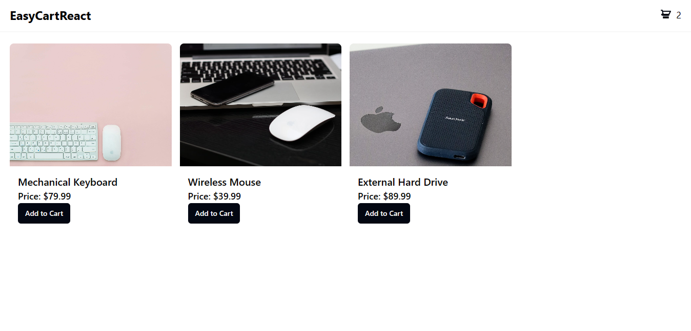
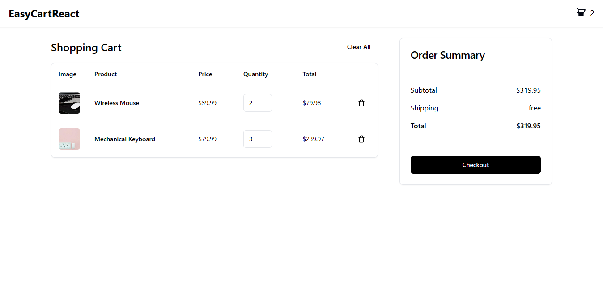

# EasyCartReact

## Description

Un projet de composant panier développé avec React.js et stylisé avec Tailwind CSS. Cette application permet aux utilisateurs d'ajouter, de supprimer et de mettre à jour la quantité des produits dans leur panier. Un helper est également inclus pour faciliter le changement de devise entre le dollar et le franc CFA.

## Technologies Utilisées

- React.js
- Tailwind CSS

## Installation

Expliquez ici comment les utilisateurs peuvent installer et exécuter votre application localement. Incluez toutes les dépendances nécessaires.

## Utilisation

1. Clonez le dépôt GitHub sur votre machine locale :

```bash
git clone https://github.com/alphajoop/EasyCartReact.git
```

2. Accédez au répertoire du projet :

```bash
cd EasyCartReact
```

3. Installez les dépendances nécessaires :

```bash
npm install
```

4. Exécutez l'application localement :

```bash
npm run dev
```

L'application sera accessible dans votre navigateur à l'adresse <http://localhost:5173>.

## Captures d'écran


_Capture d'écran de la page d'accueil de l'application._


_Capture d'écran de la page du panier avec des produits ajoutés._
